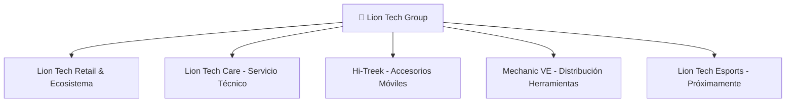
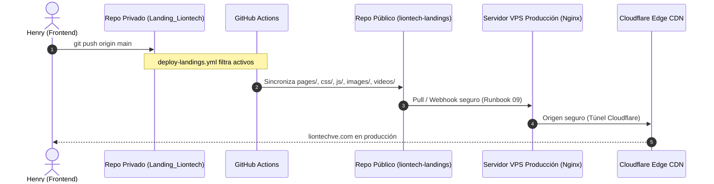

# Contexto Integral del Proyecto — Ecosistema Lion Tech

**Fecha:** 6 de octubre de 2026  
**Organización:** Lion Tech Venezuela  
**Dominio principal:** `liontechve.com`  
**Repositorio público:** `webmaster541/liontech-landings`  
**Repositorio privado fuente:** `webmaster541/Landing_Liontech`  

---

## 1. Visión y Modelo de Negocio

Lion Tech es un conglomerado tecnológico integral en Venezuela enfocado en el comercio de dispositivos, accesorios de alta gama, servicios de ingeniería y microelectrónica aplicada, y distribución mayorista de equipamiento profesional para técnicos.

### Divisiones del Ecosistema

1. **Lion Tech (Retail & Ecosistema General):**
   * Venta de smartphones (Apple iPhone, Samsung, Xiaomi), wearables, audio, laptops y ecosistema smart home.
   * Red física de 8 "Guaridas" (sucursales físicas) estratégicamente ubicadas en centros comerciales de Caracas, Los Teques y San Cristóbal.
2. **Lion Tech Care (Laboratorio de Microelectrónica):**
   * Servicio técnico especializado de nivel 3 y 4 (reparación a nivel de componentes, reballing de CPU/NAND, reconstrucción de pantallas OLED y flex, reemplazo de baterías con reprogramación de ciclos y salud).
   * Atención bajo estrictos estándares de trazabilidad y garantía escrita.
3. **Hi-Treek (Marca Propia de Accesorios):**
   * Marca enfocada en la durabilidad extrema y estética moderna: cables blindados, cargadores GaN ultra compactos, forros magnéticos MagSafe y protectores de pantalla 9H.
4. **Mechanic VE (Distribución Autorizada):**
   * Línea de distribución y equipamiento para talleres y técnicos en toda Venezuela: estaciones de calor y soldadura, microscopios trinoculares, químicos antiestáticos, bisturís y repuestos especializados.
5. **Lion Tech Esports:**
   * División de torneos, patrocinio de creadores de contenido y cultura gaming (en fase de desarrollo).

---

## 2. Red de Sedes Físicas y Logística

### Presencia Física ("Las 8 Guaridas")
* **Caracas:** Sambil Chacao, C.C. Líder, City Market (Planta Baja y Nivel 2), C.C. Galerías Ávila (La Candelaria), C.C. El Recreo.
* **Altos Mirandinos:** C.C. La Cascada (Los Teques).
* **Región Andina:** San Cristóbal (Táchira).

### Infraestructura Logística y Cobertura Nacional
* **Entregas Express Locales:** Alianza de delivery motorizado en Gran Caracas con **Yummy Rides/Delivery** y mensajería interna.
* **Envíos Nacionales Asegurados:** Integración de procesos con las cuatro principales empresas de encomiendas de Venezuela:
  * **MRW**
  * **ZOOM**
  * **TEALCA**
  * **DOMESA**

---

## 3. Canales de Conversión y Automatización (KIRA & WhatsApp)

El canal principal de ventas y atención al cliente es WhatsApp, operado mediante un modelo híbrido:
1. **Asistente Centralizado IA (KIRA):**
   * Número corporativo centralizado que recibe el tráfico de las landings principales y filtra las solicitudes:
     * Cotizaciones de reparación técnica (Lion Tech Care).
     * Disponibilidad de equipos y accesorios (Hi-Treek / Lion Tech).
     * Catálogo mayorista de herramientas (Mechanic VE).
2. **Atención Descentralizada por Guarida:**
   * Enlaces directos a las líneas de WhatsApp dedicadas de cada sede física en el mapa interactivo y carrusel de sedes.

---

## 4. Arquitectura de Repositorios y Gobernanza Técnica

### Separación de Repositorios y Seguridad
* **Repositorio Privado (`Landing_Liontech`):** Entorno donde reside el historial completo de desarrollo, scripts de automatización interna, documentación de arquitectura (`docs/`), catálogos crudos en PDF y herramientas de auditoría.
* **Repositorio Público (`liontech-landings`):** Clon público que recibe únicamente los archivos de producción necesarios para servir el sitio web.
* **Gobernanza y Privacidad:**
  * Se depuraron metadatos EXIF de imágenes y fotografías con información personal sensible.
  * Los despliegues productivos se validan por integridad de hash (`sha256sum`) contra el servidor de origen.

---

## 5. Infraestructura de Servidores y Red

* **Servidor Origen:** Servidor VPS privado administrado con Debian/Ubuntu, sirviendo archivos estáticos a través de **Nginx** con configuración estricta de caché y compresión Gzip/Brotli.
* **Capa Edge & DNS:** **Cloudflare CDN** con proxy HTTPS activo, reglas de seguridad de cabeceras, firewall de aplicaciones web (WAF) y túneles `cloudflared` para comunicación segura sin exponer puertos directos a internet.
* **Mantenimiento Cero-Downtime:** Todas las recargas de configuración se realizan mediante `nginx -s reload` (graceful reload).
