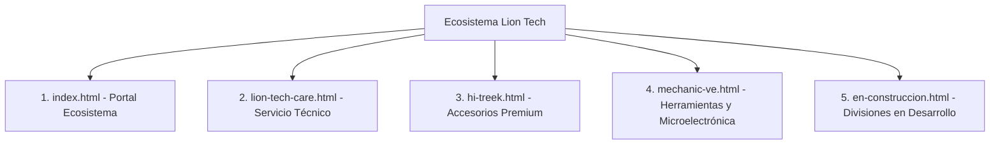

# Estado de Diseño de las Landings — Ecosistema Lion Tech

**Fecha de actualización:** 6 de octubre de 2026  
**Proyecto:** Ecosistema Web Lion Tech Venezuela (`liontechve.com`)  
**Equipo responsable:** Frontend & Diseño Web  

---

## 1. Resumen Ejecutivo de Diseño

El ecosistema web de Lion Tech está conformado por una arquitectura de landings de alto impacto visual orientadas a la conversión, confianza de marca y soporte comercial para el mercado venezolano. La estética combina un estilo tecnológico moderno (*dark mode*, acabados *glassmorphism*, iluminación radial y acentos neón) con una jerarquía tipográfica limpia y contrastada.

### Principios Rectores de la Identidad Visual
* **Paleta Base Corporativa:** Fondo profundo grafito/azul noche (`#090D16`, `#0B0F19`, `#05070B`), superficies translúcidas con desenfoque de fondo (`backdrop-filter: blur(12px)`) y bordes sutiles en degradado con baja opacidad.
* **Tipografía:** Combinación de fuentes de alta legibilidad técnica (Google Fonts: **Inter**, **Outfit** y **Rajdhani/Space Grotesk** para acentos numéricos y títulos tecnológicos).
* **Microinteracciones y Dinamismo:** Efectos *hover* con elevación, iluminación de bordes mediante degradados cónicos/lineales, carruseles fluidos con soporte táctil (*touch-swipe*) y transiciones con curvas *cubic-bezier*.
* **Mobile First & Rendimiento:** Estructura adaptativa fluida con puntos de quiebre estándar (375px, 480px, 768px, 1024px, 1280px, 1440px), optimización de activos a formato WebP y carga diferida (*lazy loading*).

---

## 2. Diagnóstico y Estado por Landing Page

---

### 2.1. Landing Principal (`pages/index.html`) — Portal Corporativo Lion Tech

* **Propósito:** Puerta de entrada al ecosistema completo. Presenta las 4 divisiones del grupo, la historia de la marca, las 8 guaridas/sucursales físicas a nivel nacional, logística de envíos y contacto centralizado.
* **Identidad Cromática:** Azul eléctrico / Cian tecnológico (`#0066FF`, `#00D2FF`, `#00F0FF`) sobre base oscura.
* **Componentes Clave y Estado de Diseño:**
  1. **Hero Section:**
     * **Estado:** Totalmente optimizado.
     * **Composición:** Fotografía del equipo de guardianas en alta definición (`hero-team-2026.webp` / `equipo-cutout.webp`) integrado con una máscara CSS compuesta (`mask-image: linear-gradient(...)`) que desvanece suavemente el borde inferior e izquierdo contra el fondo radial azul oscuro, eliminando cortes duros.
     * **Titular y Badges:** Insignia interactiva con animación de brillo tenue y CTA principal directo al enrutador de WhatsApp.
  2. **Métricas de la Manada:**
     * **Estado:** Balanceado y limpio.
     * **Estructura:** Cuadrícula de 3 columnas sobrias y proporcionales:
       * **4** Divisiones activas
       * **3** Marcas oficiales
       * **8** Guaridas en Venezuela
     * Se eliminaron tarjetas no numéricas superfluas para mantener el rigor corporativo.
  3. **Mapa Interactivo de Sedes (Guaridas):**
     * **Estado:** 100% operativo sin dependencias de claves de pago.
     * **Tecnología:** Integración de Leaflet con capas oficiales de teselas de Google Maps (`mt{s}.google.com`).
     * **UI:** Marcadores personalizados con el isotipo de Lion Tech, selector de sedes por pestañas/botones y tarjeta emergente (*popup*) con dirección exacta, horarios y botón directo a la sucursal en Google Maps y WhatsApp.
  4. **Carrusel de Sedes:**
     * **Estado:** Funcional con navegación por deslizamiento táctil y flechas de control.
     * **Contenido:** Fotografías de fachadas e interiores de las sedes (Sambil Chacao, C.C. Líder, City Market, La Candelaria, San Cristóbal, etc.).
  5. **Sección de Encomiendas y Logística:**
     * **Estado:** Homologado con logos vectoriales y transparentes oficiales de Domesa, MRW, Tealca, Zoom y Yummy Delivery.

---

### 2.2. Landing Lion Tech Care (`pages/lion-tech-care.html`) — Servicio Técnico Especializado

* **Propósito:** Transmitir máxima confianza, rigurosidad técnica y profesionalismo en microelectrónica y reparación de dispositivos de alta gama (Apple iPhone, iPad, Mac, Apple Watch, Android gama alta y consolas).
* **Identidad Cromática:** Cian médico/quirúrgico (`#00D2FF`), Azul Cobalto (`#0A2540`) y blanco titanio.
* **Componentes Clave y Estado de Diseño:**
  1. **Hero de Laboratorio:**
     * Imagen de fondo de laboratorio de microelectrónica y mesa de trabajo de precisión (`svc-care.webp`).
     * Títulos enfocados en garantía escrita, diagnósticos con microscopio trinocular y trazabilidad.
  2. **Matriz de Especialidades Técnicas:**
     * Tarjetas modulares de servicio: Reballing de placa base, trasplante de IC / Memorias, reconstrucción de Flex y pantallas sin mensajes de error de sistema, calibración de baterías y reparación de cámaras.
     * Efecto *hover* con elevación de tarjeta e iluminación de bordes con acento cian.
  3. **Flujo de Atención en 4 Pasos:**
     * Diagrama de pasos: Recepción/Check-in → Diagnóstico con instrumental Mechanic → Cotización transparente → Entrega con garantía.
  4. **Cotizador Rápido Flotante:**
     * Botón flotante persistente hacia WhatsApp KIRA preconfigurado con mensaje estructurado para agilizar la cotización de fallas comunes.

---

### 2.3. Landing Hi-Treek (`pages/hi-treek.html`) — Accesorios Prémium

* **Propósito:** Presentación de la marca propia de accesorios móviles de alta durabilidad, diseño deportivo-urbano y tecnología de carga rápida.
* **Identidad Cromática:** Acentos en Verde Lima Eléctrico / Amarillo Neón (`#00FF87`, `#CCFF00`) contrastado con negro mate profundo (`#0A0A0A`).
* **Componentes Clave y Estado de Diseño:**
  1. **Hero Multimedia:**
     * Reproductor de video publicitario integrado (`PublicidadHi_treek.mp4` / poster optimizado) con controles discretos y reproducción fluida.
     * Titulares en tipografía deportiva de gran impacto visual.
  2. **Showcase de Categorías:**
     * *Power Delivery & GaN:* Cargadores de pared ultrarrápidos y cables trenzados con blindaje kevlar.
     * *Protection:* Vidrios templados 9H con marco de instalación y forros MagSafe antishock.
     * *Lifestyle & Audio:* Straps de muñeca/cuello reforzados y soportes ergonómicos.
  3. **Galería de Producto en Alta Definición:**
     * Cuadrículas fotográficas con efecto zoom y detalle de materiales.

---

### 2.4. Landing Mechanic VE (`pages/mechanic-ve.html`) — Distribución de Herramientas

* **Propósito:** Catálogo comercial y técnico para laboratorios, academias y profesionales de la reparación de telefonía y microelectrónica en Venezuela.
* **Identidad Cromática:** Amarillo Industrial Mechanic (`#FFB800`, `#FFC700`), Naranja advertencia (`#FF5722`) y Gris grafito texturizado (`#1A1A1A`).
* **Componentes Clave y Estado de Diseño:**
  1. **Hero Profesional:**
     * Presentación de la alianza oficial con Mechanic, destacando microscopios trinoculares y estaciones de soldadura de grado profesional.
  2. **Catálogo Interactivo con Filtrado Dinámico:**
     * **Estado:** Completamente estructurado e indexado en el DOM con soporte de búsqueda en tiempo real.
     * **Categorías activas:**
       * Estaciones de Soldadura y Cautines (T12-Pro, etc.)
       * Aleaciones de Estaño y Reballing (XZW25, pastas, mallas)
       * Dispensadores y Químicos (SD150A, TF01, solventes)
       * Cuchillas de Desgomado y Bisturís (GK8, FR1, kit 004)
       * Hilos y Cables de Separación LCD (iLine, etc.)
       * Microscopios y Óptica
     * **Tarjetas de Producto:** Imagen nítida, título exacto de modelo/SKU, descripción técnica, lista de usos recomendados y botón "Solicitar por WhatsApp".
  3. **Barra de Búsqueda y Paginación:**
     * Motor de búsqueda en tiempo real que filtra tarjetas por nombre de producto o código SKU sin recargar la página.

---

### 2.5. Página "En Construcción" (`pages/en-construccion.html`)

* **Propósito:** Página de aterrizaje estética para marcas o divisiones próximas a lanzarse (ej. Lion Tech Esports, nuevas líneas de producto).
* **Estado:** Limpia y minimalista. Se removieron contenedores y animaciones innecesarias en favor de logotipos vectoriales transparentes, texto elegante de estado y botón de retorno al portal principal.

---

## 3. Estado de Activos Gráficos y Optimización

| Activo / Módulo | Formato Original | Formato Actual | Estado / Reducción |
|---|---|---|---|
| **Favicon Principal** | PNG con márgenes (ilegible) | `favicon-liontech.png` (128x128px exacto) | 100% nítido en navegador |
| **Hero Image Team** | PNG (10.4 MB) | `hero-team-2026.webp` (~170 KB) | -98% de peso / Carga instantánea |
| **Imágenes de Servicios** | JPG / PNG (>3 MB c/u) | WebP optimizados (~80-150 KB) | Sin pérdida de nitidez |
| **Logos Aliados Envíos** | JPGs con fondo blanco | PNG transparentes / WebP | Perfecta integración en Dark Mode |
| **Teselas de Mapa** | CartoDB (bloqueado con watermark) | Google Maps Tiles (`lyrs=m`) | Estable y libre de marcas de agua |

---

## 4. Próximos Pasos Recomendados en Diseño

1. **Unificación de Tokens CSS:** Consolidar las variables de color, espaciado y tipografía en una hoja de estilos compartida (`css/tokens.css` o `css/global-theme.css`) para evitar duplicación entre las 5 páginas.
2. **Animaciones de Entrada (IntersectionObserver):** Implementar transiciones suaves cuando los elementos entran en el viewport para enriquecer la experiencia de usuario.
3. **Lazy Loading de Videos:** Asegurar que los elementos `<video>` utilicen `preload="none"` o `preload="metadata"` con posters WebP ligeros para no penalizar el tiempo de primera carga (FCP/LCP).
