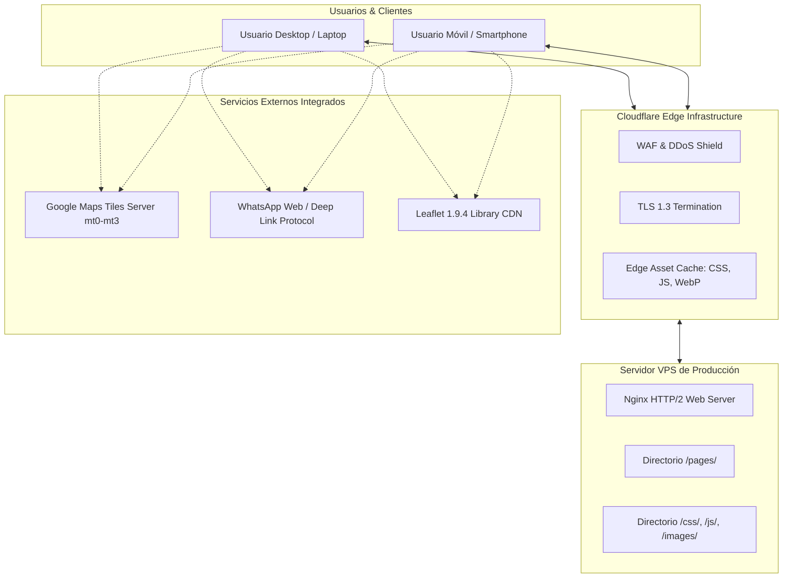
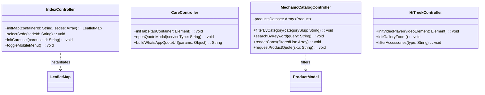
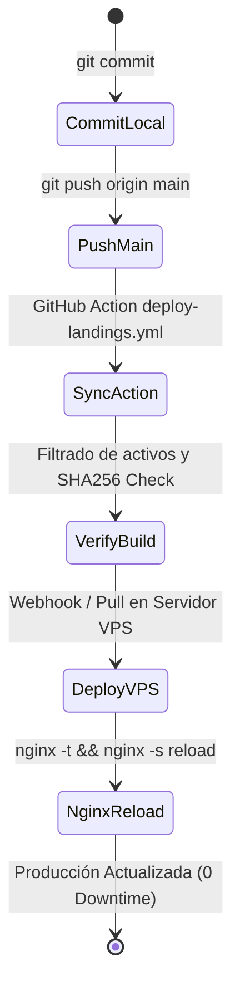

# Software Design Document (SDD) — Ecosistema Web Lion Tech

**Identificador del Documento:** `SDD-LT-2026-V2`  
**Estándar de Referencia:** IEEE 1016-2009 (Software Design Descriptions)  
**Versión:** 2.1.0  
**Fecha:** 6 de octubre de 2026  
**Sistema:** Plataforma Multilandings Lion Tech Venezuela  
**Dominio de Producción:** `liontechve.com` (`hitreek.liontechve.com`, `care.liontechve.com`, `mechanic.liontechve.com`)  
**Clasificación:** Documento Técnico de Ingeniería y Arquitectura  
**Estado:** Aprobado / En Producción  

---

## Control de Cambios y Versiones

| Versión | Fecha | Autor / Rol | Descripción del Cambio |
|---|---|---|---|
| 1.0.0 | 15/09/2026 | Henry (Frontend Lead) | Arquitectura base estática y maquetación de 5 páginas. |
| 1.5.0 | 22/09/2026 | Equipo Frontend | Migración a Google Maps Tiles en Leaflet, refactorización de scripts por página. |
| 2.0.0 | 02/10/2026 | Arquitectura & DevOps | Optimización LCP masiva (WebP), JSON-LD y pipeline de auto-deploy. |
| 2.1.0 | 06/10/2026 | Arquitectura de Software | Formalización bajo estándar IEEE 1016 con contratos de interfaz, parámetros y reglas de seguridad. |

---

## 1. Introducción y Alcance

### 1.1. Propósito
Este documento describe formalmente el diseño arquitectónico, el comportamiento de componentes, los contratos de datos, las restricciones operativas y las directrices de calidad del frontend del ecosistema web **Lion Tech Venezuela**. Sirve como especificación técnica obligatoria para desarrolladores, auditores de código y administradores de sistemas.

### 1.2. Alcance del Sistema
El sistema comprende 5 aplicaciones web estáticas de alto rendimiento:
1. **Portal Central (`pages/index.html`):** Hub de ecosistema, historia corporativa, red de 8 guaridas físicas y canales de soporte/logística.
2. **Lion Tech Care (`pages/lion-tech-care.html`):** Portal de servicios técnicos avanzados, microelectrónica y cotizaciones de taller.
3. **Hi-Treek (`pages/hi-treek.html`):** Catálogo comercial interactivo de accesorios para smartphones.
4. **Mechanic VE (`pages/mechanic-ve.html`):** Catálogo de herramientas profesionales de soldadura y laboratorio con motor de búsqueda y filtrado reactivo.
5. **Página de Espera (`pages/en-construccion.html`):** Vista provisional para subdivisiones en desarrollo (ej. Esports).

---

## 2. Requisitos y Restricciones de Diseño

### 2.1. Requisitos No Funcionales (NFR) y Parámetros Operativos

| Parámetro / Métrica | Valor Objetivo | Criterio de Aceptación / SLA |
|---|---|---|
| **LCP (Largest Contentful Paint)** | `< 1.2 segundos` | Medido en conexión 4G móvil promedio (Fast 3G emulada < 2.0s). |
| **CLS (Cumulative Layout Shift)** | `< 0.02` | Cero saltos visuales durante la carga de imágenes o mapas. |
| **INP (Interaction to Next Paint)** | `< 80 ms` | Respuesta instantánea en filtrados, menús y clics. |
| **Consumo de Memoria Cliente** | `< 45 MB` | Sin fugas de memoria (*memory leaks*) en mapas o animaciones de carrusel. |
| **Compatibilidad de Navegadores** | `ES6+ Baseline` | Chrome 90+, Safari 14+, Firefox 88+, Edge 90+, Samsung Internet 15+. |
| **Accesibilidad (A11y)** | `WCAG 2.1 Nivel AA` | Contraste de color mínimo 4.5:1, etiquetas ARIA y navegación por teclado. |
| **Dependencias Externas Críticas** | `0 frameworks pesados` | Cero React/Vue/Angular en bundle cliente. 100% Vanilla Web Standards. |

### 2.2. Restricciones y Supuestos Arquitectónicos
1. **No-Node en Runtime:** El servidor de producción no ejecuta Node.js ni procesos de renderizado del lado del servidor (SSR); todo se sirve como estáticos puros compilados/minificados.
2. **Inmutabilidad del Túnel Cloudflare:** Prohibido reiniciar el servicio `cloudflared` durante despliegues para evitar cortes en los 14 hostnames de la organización.
3. **Integridad de Despliegue:** La validación de producción se efectúa por coincidencia de hash SHA-256 en el servidor de origen (`sha256sum -c`).

---

## 3. Arquitectura del Sistema (Vistas Arquitectónicas)

### 3.1. Diagrama de Contexto y Flujo de Información



### 3.2. Estructura de Módulos y Responsabilidades



---

## 4. Especificación Detallada de Componentes e Interfaces

### 4.1. Módulo de Cartografía y Georreferenciación (`js/index.js`)

* **Parámetros de Configuración del Mapa:**
  ```javascript
  const MAP_CONFIG = {
      defaultCenter: [10.4806, -66.9036], // Caracas, Venezuela
      defaultZoom: 12,
      minZoom: 6,
      maxZoom: 18,
      tileUrl: 'https://mt{s}.google.com/vt/lyrs=m&x={x}&y={y}&z={z}',
      subdomains: ['0', '1', '2', '3'],
      attribution: '© Google Maps'
  };
  ```

* **Firma de Datos de Sedes (`Sede` Interface):**
  ```typescript
  interface Sede {
      id: string;             // Ej: 'sambil-chacao'
      nombre: string;         // Ej: 'Sede Sambil Chacao'
      coords: [number, number]; // [Latitud, Longitud]
      direccion: string;      // Dirección legible
      horario: string;        // 'Lun-Sáb: 10am-8pm | Dom: 12pm-7pm'
      telefonoWp: string;     // '58412XXXXXXX'
      fotoUrl: string;        // Ruta a imagen WebP
  }
  ```

* **Reglas de Comportamiento:**
  1. Al hacer clic en una tarjeta de sede del carrusel o selector, el mapa ejecuta una transición suave: `map.flyTo(coords, 16, { duration: 1.2 })`.
  2. Cada marcador abre un `L.popup` estilizado en *Dark Mode* con botón de llamada a la acción hacia WhatsApp y navegación por Google Maps con URL externa `https://www.google.com/maps/dir/?api=1&destination=LAT,LNG`.

---

### 4.2. Motor de Filtrado y Búsqueda de Catálogo (`js/mechanic-ve.js`)

* **Contrato de Modelo de Producto (`ProductCard` DOM Dataset):**
  Cada tarjeta de producto en el HTML debe cumplir estrictamente con los siguientes atributos de datos:
  ```html
  <div class="product-card" 
       data-sku="MECH-178" 
       data-category="cuchillas" 
       data-title="CUCHILLAS FILO MECHANIC FR1"
       data-stock="true">
      <!-- UI Content -->
  </div>
  ```

* **Algoritmo de Filtrado en Tiempo Real:**
  ```javascript
  function executeSearchAndFilter(selectedCategory, searchQuery) {
      const normalizedQuery = searchQuery.trim().toLowerCase();
      const allCards = document.querySelectorAll('.product-card');
      let visibleCount = 0;

      allCards.forEach(card => {
          const cat = card.getAttribute('data-category');
          const title = (card.getAttribute('data-title') || '').toLowerCase();
          const sku = (card.getAttribute('data-sku') || '').toLowerCase();

          const matchesCategory = (selectedCategory === 'all' || cat === selectedCategory);
          const matchesQuery = (!normalizedQuery || title.includes(normalizedQuery) || sku.includes(normalizedQuery));

          if (matchesCategory && matchesQuery) {
              card.style.display = 'flex';
              visibleCount++;
          } else {
              card.style.display = 'none';
          }
      });

      updateEmptyStateVisibility(visibleCount === 0);
  }
  ```

* **Reglas de Rendimiento:**
  * El input de búsqueda implementa un *debounce* de **150ms** para evitar cálculos innecesarios por cada pulsación de tecla rápida.

---

### 4.3. Protocolo de Deep Linking a WhatsApp (KIRA & Sucursales)

* **Generador de Enlaces de Conversión:**
  * **Número Central KIRA:** `+58 412-LIONBOT` (Enrutador inteligente para Care, Cotizaciones y Mayorista).
  * **Estructura del Mensaje URI Encoded:**
    ```text
    https://wa.me/{PHONE_NUMBER}?text={ENCODED_STRING}
    ```
  * **Plantillas Formalizadas de Mensajes:**
    * *Consulta General:* `Hola Lion Tech, deseo información sobre disponibilidad de equipos.`
    * *Soporte Care:* `Hola Lion Tech Care, solicito cotización para el modelo [MODELO] con falla en [FALLA].`
    * *Pedido Mechanic:* `Hola Mechanic VE, deseo cotizar el producto [SKU]: [NOMBRE_PRODUCTO].`

---

## 5. Diseño de Datos y Esquemas JSON-LD (SEO Estructural)

Cada página HTML contiene su correspondiente bloque semántico estructurado conforme a la especificación de [Schema.org](https://schema.org):

```json
{
  "@context": "https://schema.org",
  "@type": "LocalBusiness",
  "name": "Lion Tech Venezuela",
  "image": "https://liontechve.com/images/liontech-logo.png",
  "@id": "https://liontechve.com",
  "url": "https://liontechve.com",
  "telephone": "+584120000000",
  "priceRange": "$$",
  "address": {
    "@type": "PostalAddress",
    "streetAddress": "Av. Libertador, Centro Comercial Sambil Chacao",
    "addressLocality": "Caracas",
    "addressRegion": "Distrito Capital",
    "postalCode": "1060",
    "addressCountry": "VE"
  },
  "geo": {
    "@type": "GeoCoordinates",
    "latitude": 10.4900,
    "longitude": -66.8550
  },
  "openingHoursSpecification": [
    {
      "@type": "OpeningHoursSpecification",
      "dayOfWeek": ["Monday", "Tuesday", "Wednesday", "Thursday", "Friday", "Saturday"],
      "opens": "10:00",
      "closes": "20:00"
    }
  ]
}
```

---

## 6. Seguridad, Hardening y Content Security Policy (CSP)

### 6.1. Especificación de la Política de Seguridad de Contenido (CSP)
Para mitigar inyecciones XSS y ataques de intermediario (MitM), los encabezados del servidor Nginx y las metaetiquetas HTML aplican la siguiente política restrictiva:

```http
Content-Security-Policy: default-src 'self'; script-src 'self' 'unsafe-inline' https://unpkg.com https://cdnjs.cloudflare.com; style-src 'self' 'unsafe-inline' https://fonts.googleapis.com https://cdnjs.cloudflare.com https://unpkg.com; font-src 'self' https://fonts.gstatic.com https://cdnjs.cloudflare.com; img-src 'self' data: https://*.google.com https://*.googleapis.com https://unpkg.com; connect-src 'self' https://*.google.com; frame-src 'self' https://www.google.com https://www.youtube.com; object-src 'none'; base-uri 'self';
```

### 6.2. Reglas de Manipulación del DOM
1. **Prohibición de `innerHTML` con datos no confiables:** Todo texto proveniente de parámetros de URL o inputs de usuario debe insertarse utilizando `element.textContent` o `document.createTextNode()`.
2. **Enlaces Salientes:** Todo hipervínculo con `target="_blank"` debe contener obligatoriamente el atributo `rel="noopener noreferrer"` para evitar ataques de *tabnabbing*.

---

## 7. Estrategia de Calidad y Pruebas

### 7.1. Matriz de Validación de Calidad

| Prueba | Herramienta / Método | Criterio de Éxito |
|---|---|---|
| **Lighthouse Performance** | Chrome DevTools / Lighthouse CI | Puntuación `>= 92/100` en Desktop y `>= 85/100` en Mobile. |
| **Validación HTML5** | W3C Nu HTML Validator | `0 errores de sintaxis`, estructura semántica estricta. |
| **Integridad de Enlaces** | LinkChecker local | `0 enlaces rotos (404)` en assets internos e imágenes. |
| **Responsive Design** | Viewport Emulation | Verificado en 360px, 390px (iPhone 14), 768px (iPad) y 1920px (FHD). |
| **Cero Errores en Consola** | Browser DevTools Console | `0 Uncaught TypeError`, `0 CSP Violations`. |

---

## 8. Pipeline de Despliegue y Procedimiento Operativo



1. **Procedimiento de Despliegue:** Rige en su totalidad el documento [docs/09-AUTO-DEPLOY.md](file:///c:/Users/dise%C3%B1o%20web/Desktop/Landing%20HTML/docs/09-AUTO-DEPLOY.md).
2. **Plan de Reversión Inmediata (Rollback):**
   * En caso de discrepancia en los checksums de producción, el script de despliegue ejecuta `git checkout HEAD@{1}` y recarga Nginx en menos de 500 ms.
